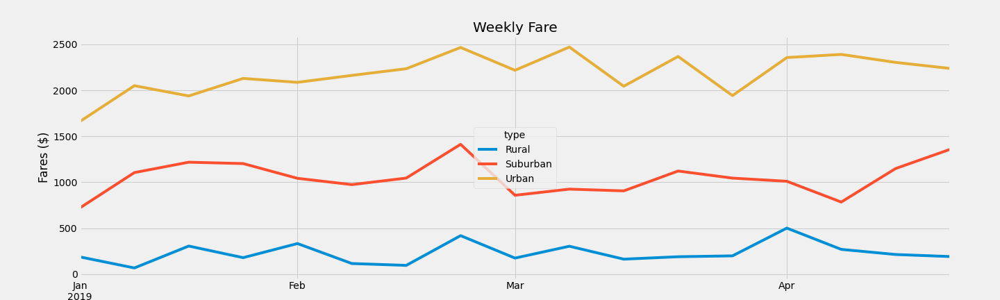

# **Pyber_Analysis**

## **Importing the necessary libraries**

```python
# Add Matplotlib inline magic command
%matplotlib inline
# Dependencies and Setup
import matplotlib.pyplot as plt
import pandas as pd

### **Loading the data**
city_data_to_load = "Resources/ride_data.csv"
ride_data_to_load = "Resources/city_data.csv"

# Read the City and Ride Data
city_data_df = pd.read_csv(city_data_to_load)
ride_data_df = pd.read_csv(ride_data_to_load)
```

### Merge the DataFrames

```python
# Combine the data into a single dataset
pyber_data_df = pd.merge(ride_data_df, city_data_df, how="left", on=["city", "city"])
### **View the first and the last 5 rows of the dataset**
pyber_data_df.head()
```
<div>
<table border="1" class="dataframe">
  <thead>
    <tr style="text-align: right;">
      <th></th>
      <th>city</th>
      <th>driver_count</th>
      <th>type</th>
      <th>date</th>
      <th>fare</th>
      <th>ride_id</th>
    </tr>
  </thead>
  <tbody>
    <tr>
      <th>0</th>
      <td>Richardfort</td>
      <td>38</td>
      <td>Urban</td>
      <td>2019-02-24 08:40:38</td>
      <td>13.93</td>
      <td>5628545007794</td>
    </tr>
    <tr>
      <th>1</th>
      <td>Richardfort</td>
      <td>38</td>
      <td>Urban</td>
      <td>2019-02-13 12:46:07</td>
      <td>14.00</td>
      <td>910050116494</td>
    </tr>
    <tr>
      <th>2</th>
      <td>Richardfort</td>
      <td>38</td>
      <td>Urban</td>
      <td>2019-02-16 13:52:19</td>
      <td>17.92</td>
      <td>820639054416</td>
    </tr>
    <tr>
      <th>3</th>
      <td>Richardfort</td>
      <td>38</td>
      <td>Urban</td>
      <td>2019-02-01 20:18:28</td>
      <td>10.26</td>
      <td>9554935945413</td>
    </tr>
    <tr>
      <th>4</th>
      <td>Richardfort</td>
      <td>38</td>
      <td>Urban</td>
      <td>2019-04-17 02:26:37</td>
      <td>23.00</td>
      <td>720020655850</td>
    </tr>
  </tbody>
</table>
</div>

```python
pyber_data_df.tail()
```

<div>
<table border="1" class="dataframe">
  <thead>
    <tr style="text-align: right;">
      <th></th>
      <th>city</th>
      <th>driver_count</th>
      <th>type</th>
      <th>date</th>
      <th>fare</th>
      <th>ride_id</th>
    </tr>
  </thead>
  <tbody>
    <tr>
      <th>2370</th>
      <td>Jessicaport</td>
      <td>1</td>
      <td>Rural</td>
      <td>2019-01-31 17:57:25</td>
      <td>58.29</td>
      <td>623154556195</td>
    </tr>
    <tr>
      <th>2371</th>
      <td>South Saramouth</td>
      <td>7</td>
      <td>Rural</td>
      <td>2019-02-20 16:32:36</td>
      <td>44.29</td>
      <td>3622365199969</td>
    </tr>
    <tr>
      <th>2372</th>
      <td>South Saramouth</td>
      <td>7</td>
      <td>Rural</td>
      <td>2019-01-28 15:55:33</td>
      <td>31.25</td>
      <td>7118046558393</td>
    </tr>
    <tr>
      <th>2373</th>
      <td>South Saramouth</td>
      <td>7</td>
      <td>Rural</td>
      <td>2019-03-27 21:07:16</td>
      <td>11.87</td>
      <td>170351888128</td>
    </tr>
    <tr>
      <th>2374</th>
      <td>South Saramouth</td>
      <td>7</td>
      <td>Rural</td>
      <td>2019-04-12 18:11:50</td>
      <td>57.23</td>
      <td>5081198789583</td>
    </tr>
  </tbody>
</table>
</div>

## Deliverable 1: Get a Summary DataFrame 

```python
#  1. Get the total rides for each city type
total_rides = pyber_data_df.groupby("type").count()[["ride_id"]]
total_rides
```
<div>
<table border="1" class="dataframe">
  <thead>
    <tr style="text-align: right;">
      <th></th>
      <th>ride_id</th>
    </tr>
    <tr>
      <th>type</th>
      <th></th>
    </tr>
  </thead>
  <tbody>
    <tr>
      <th>Rural</th>
      <td>125</td>
    </tr>
    <tr>
      <th>Suburban</th>
      <td>625</td>
    </tr>
    <tr>
      <th>Urban</th>
      <td>1625</td>
    </tr>
  </tbody>
</table>
</div>

```python
# 2. Get the total drivers for each city type
total_drivers = ride_data_df.groupby("type").sum()[["driver_count"]]
total_drivers
```

<div>
<table border="1" class="dataframe">
  <thead>
    <tr style="text-align: right;">
      <th></th>
      <th>driver_count</th>
    </tr>
    <tr>
      <th>type</th>
      <th></th>
    </tr>
  </thead>
  <tbody>
    <tr>
      <th>Rural</th>
      <td>78</td>
    </tr>
    <tr>
      <th>Suburban</th>
      <td>490</td>
    </tr>
    <tr>
      <th>Urban</th>
      <td>2405</td>
    </tr>
  </tbody>
</table>
</div>

```python
#  3. Get the total amount of fares for each city type
total_fares = pyber_data_df.groupby("type").sum()[["fare"]]
total_fares.rename(columns = {"fare": "Total Fares"}, inplace = True)
total_fares
```
<div>

<table border="1" class="dataframe">
  <thead>
    <tr style="text-align: right;">
      <th></th>
      <th>Total Fares</th>
    </tr>
    <tr>
      <th>type</th>
      <th></th>
    </tr>
  </thead>
  <tbody>
    <tr>
      <th>Rural</th>
      <td>4327.93</td>
    </tr>
    <tr>
      <th>Suburban</th>
      <td>19356.33</td>
    </tr>
    <tr>
      <th>Urban</th>
      <td>39854.38</td>
    </tr>
  </tbody>
</table>
</div>

```python
#  4. Get the average fare per ride for each city type. 
# calculate the average fare per ride by city type by dividing the sum of all the fares by the total rides.
avg_fare = pyber_data_df.groupby("type").mean()[["fare"]]
avg_fare.rename(columns = {"fare": "Average Fare/Ride"}, inplace = True)
avg_fare
```
<div>
<table border="1" class="dataframe">
  <thead>
    <tr style="text-align: right;">
      <th></th>
      <th>Average Fare/Ride</th>
    </tr>
    <tr>
      <th>type</th>
      <th></th>
    </tr>
  </thead>
  <tbody>
    <tr>
      <th>Rural</th>
      <td>34.623440</td>
    </tr>
    <tr>
      <th>Suburban</th>
      <td>30.970128</td>
    </tr>
    <tr>
      <th>Urban</th>
      <td>24.525772</td>
    </tr>
  </tbody>
</table>
</div>

```python
# 5. Get the average fare per driver for each city type. 
# calculate the average fare per driver by city type by dividing the sum of all the fares by the total drivers.
avg_fare_driver = pd.DataFrame(total_fares["Total Fares"]/total_drivers["driver_count"])
avg_fare_driver
```

<div>
<table border="1" class="dataframe">
  <thead>
    <tr style="text-align: right;">
      <th></th>
      <th>0</th>
    </tr>
    <tr>
      <th>type</th>
      <th></th>
    </tr>
  </thead>
  <tbody>
    <tr>
      <th>Rural</th>
      <td>55.486282</td>
    </tr>
    <tr>
      <th>Suburban</th>
      <td>39.502714</td>
    </tr>
    <tr>
      <th>Urban</th>
      <td>16.571468</td>
    </tr>
  </tbody>
</table>
</div>

```python
#  6. Create a PyBer summary DataFrame. 
list_df = [total_rides, total_drivers, total_fares, avg_fare, avg_fare_driver]
pyber_summary_df = pd.concat(list_df, axis = 1)
pyber_summary_df
```

<div>
<table border="1" class="dataframe">
  <thead>
    <tr style="text-align: right;">
      <th></th>
      <th>ride_id</th>
      <th>driver_count</th>
      <th>Total Fares</th>
      <th>Average Fare/Ride</th>
      <th>0</th>
    </tr>
    <tr>
      <th>type</th>
      <th></th>
      <th></th>
      <th></th>
      <th></th>
      <th></th>
    </tr>
  </thead>
  <tbody>
    <tr>
      <th>Rural</th>
      <td>125</td>
      <td>78</td>
      <td>4327.93</td>
      <td>34.623440</td>
      <td>55.486282</td>
    </tr>
    <tr>
      <th>Suburban</th>
      <td>625</td>
      <td>490</td>
      <td>19356.33</td>
      <td>30.970128</td>
      <td>39.502714</td>
    </tr>
    <tr>
      <th>Urban</th>
      <td>1625</td>
      <td>2405</td>
      <td>39854.38</td>
      <td>24.525772</td>
      <td>16.571468</td>
    </tr>
  </tbody>
</table>
</div>

```python
#  7. Cleaning up the DataFrame. Delete the index name
pyber_summary_df.index.name = None
pyber_summary_df
```
<div>

<table border="1" class="dataframe">
  <thead>
    <tr style="text-align: right;">
      <th></th>
      <th>ride_id</th>
      <th>driver_count</th>
      <th>Total Fares</th>
      <th>Average Fare/Ride</th>
      <th>0</th>
    </tr>
  </thead>
  <tbody>
    <tr>
      <th>Rural</th>
      <td>125</td>
      <td>78</td>
      <td>4327.93</td>
      <td>34.623440</td>
      <td>55.486282</td>
    </tr>
    <tr>
      <th>Suburban</th>
      <td>625</td>
      <td>490</td>
      <td>19356.33</td>
      <td>30.970128</td>
      <td>39.502714</td>
    </tr>
    <tr>
      <th>Urban</th>
      <td>1625</td>
      <td>2405</td>
      <td>39854.38</td>
      <td>24.525772</td>
      <td>16.571468</td>
    </tr>
  </tbody>
</table>
</div>

```python
#  8. Format the columns.
pd.options.display.float_format = '${:,.2f}'.format
pyber_summary_df.rename(columns = {"ride_id": "Total Rides", 
                                   "driver_count": "Total Drivers", 
                                   "fare":"Total Fares", 
                                   "fare": "Average Fare/Ride", 0:"Average Fare/Driver"})
```


<div>

<table border="1" class="dataframe">
  <thead>
    <tr style="text-align: right;">
      <th></th>
      <th>Total Rides</th>
      <th>Total Drivers</th>
      <th>Total Fares</th>
      <th>Average Fare/Ride</th>
      <th>Average Fare/Driver</th>
    </tr>
  </thead>
  <tbody>
    <tr>
      <th>Rural</th>
      <td>125</td>
      <td>78</td>
      <td>$4,327.93</td>
      <td>$34.62</td>
      <td>$55.49</td>
    </tr>
    <tr>
      <th>Suburban</th>
      <td>625</td>
      <td>490</td>
      <td>$19,356.33</td>
      <td>$30.97</td>
      <td>$39.50</td>
    </tr>
    <tr>
      <th>Urban</th>
      <td>1625</td>
      <td>2405</td>
      <td>$39,854.38</td>
      <td>$24.53</td>
      <td>$16.57</td>
    </tr>
  </tbody>
</table>
</div>

## Deliverable 2.  Create a multiple line plot that shows the total weekly of the fares for each type of city.

```python
# 1. Read the merged DataFrame
pyber_data_df
```
<div>
<table border="1" class="dataframe">
  <thead>
    <tr style="text-align: right;">
      <th></th>
      <th>city</th>
      <th>driver_count</th>
      <th>type</th>
      <th>date</th>
      <th>fare</th>
      <th>ride_id</th>
    </tr>
  </thead>
  <tbody>
    <tr>
      <th>0</th>
      <td>Richardfort</td>
      <td>38</td>
      <td>Urban</td>
      <td>2019-02-24 08:40:38</td>
      <td>$13.93</td>
      <td>5628545007794</td>
    </tr>
    <tr>
      <th>1</th>
      <td>Richardfort</td>
      <td>38</td>
      <td>Urban</td>
      <td>2019-02-13 12:46:07</td>
      <td>$14.00</td>
      <td>910050116494</td>
    </tr>
    <tr>
      <th>2</th>
      <td>Richardfort</td>
      <td>38</td>
      <td>Urban</td>
      <td>2019-02-16 13:52:19</td>
      <td>$17.92</td>
      <td>820639054416</td>
    </tr>
    <tr>
      <th>3</th>
      <td>Richardfort</td>
      <td>38</td>
      <td>Urban</td>
      <td>2019-02-01 20:18:28</td>
      <td>$10.26</td>
      <td>9554935945413</td>
    </tr>
    <tr>
      <th>4</th>
      <td>Richardfort</td>
      <td>38</td>
      <td>Urban</td>
      <td>2019-04-17 02:26:37</td>
      <td>$23.00</td>
      <td>720020655850</td>
    </tr>
    <tr>
      <th>...</th>
      <td>...</td>
      <td>...</td>
      <td>...</td>
      <td>...</td>
      <td>...</td>
      <td>...</td>
    </tr>
    <tr>
      <th>2370</th>
      <td>Jessicaport</td>
      <td>1</td>
      <td>Rural</td>
      <td>2019-01-31 17:57:25</td>
      <td>$58.29</td>
      <td>623154556195</td>
    </tr>
    <tr>
      <th>2371</th>
      <td>South Saramouth</td>
      <td>7</td>
      <td>Rural</td>
      <td>2019-02-20 16:32:36</td>
      <td>$44.29</td>
      <td>3622365199969</td>
    </tr>
    <tr>
      <th>2372</th>
      <td>South Saramouth</td>
      <td>7</td>
      <td>Rural</td>
      <td>2019-01-28 15:55:33</td>
      <td>$31.25</td>
      <td>7118046558393</td>
    </tr>
    <tr>
      <th>2373</th>
      <td>South Saramouth</td>
      <td>7</td>
      <td>Rural</td>
      <td>2019-03-27 21:07:16</td>
      <td>$11.87</td>
      <td>170351888128</td>
    </tr>
    <tr>
      <th>2374</th>
      <td>South Saramouth</td>
      <td>7</td>
      <td>Rural</td>
      <td>2019-04-12 18:11:50</td>
      <td>$57.23</td>
      <td>5081198789583</td>
    </tr>
  </tbody>
</table>
<p>2375 rows × 6 columns</p>
</div>

```python
# 2. Using groupby() to create a new DataFrame showing the sum of the fares 
#  for each date where the indices are the city type and date.
fare_dates_df = pyber_data_df.groupby(["type", "date"]).sum()[["fare"]]
fare_dates_df
```
<div>

<table border="1" class="dataframe">
  <thead>
    <tr style="text-align: right;">
      <th></th>
      <th></th>
      <th>fare</th>
    </tr>
    <tr>
      <th>type</th>
      <th>date</th>
      <th></th>
    </tr>
  </thead>
  <tbody>
    <tr>
      <th rowspan="5" valign="top">Rural</th>
      <th>2019-01-01 09:45:36</th>
      <td>$43.69</td>
    </tr>
    <tr>
      <th>2019-01-02 11:18:32</th>
      <td>$52.12</td>
    </tr>
    <tr>
      <th>2019-01-03 19:51:01</th>
      <td>$19.90</td>
    </tr>
    <tr>
      <th>2019-01-04 03:31:26</th>
      <td>$24.88</td>
    </tr>
    <tr>
      <th>2019-01-06 07:38:40</th>
      <td>$47.33</td>
    </tr>
    <tr>
      <th>...</th>
      <th>...</th>
      <td>...</td>
    </tr>
    <tr>
      <th rowspan="5" valign="top">Urban</th>
      <th>2019-05-08 04:20:00</th>
      <td>$21.99</td>
    </tr>
    <tr>
      <th>2019-05-08 04:39:49</th>
      <td>$18.45</td>
    </tr>
    <tr>
      <th>2019-05-08 07:29:01</th>
      <td>$18.55</td>
    </tr>
    <tr>
      <th>2019-05-08 11:38:35</th>
      <td>$19.77</td>
    </tr>
    <tr>
      <th>2019-05-08 13:10:18</th>
      <td>$18.04</td>
    </tr>
  </tbody>
</table>
<p>2375 rows × 1 columns</p>
</div>

```python
# 3. Reset the index on the DataFrame you created in #1. This is needed to use the 'pivot()' function.
fare_dates_df = fare_dates_df.reset_index()
fare_dates_df
```
<div>

<table border="1" class="dataframe">
  <thead>
    <tr style="text-align: right;">
      <th></th>
      <th>type</th>
      <th>date</th>
      <th>fare</th>
    </tr>
  </thead>
  <tbody>
    <tr>
      <th>0</th>
      <td>Rural</td>
      <td>2019-01-01 09:45:36</td>
      <td>$43.69</td>
    </tr>
    <tr>
      <th>1</th>
      <td>Rural</td>
      <td>2019-01-02 11:18:32</td>
      <td>$52.12</td>
    </tr>
    <tr>
      <th>2</th>
      <td>Rural</td>
      <td>2019-01-03 19:51:01</td>
      <td>$19.90</td>
    </tr>
    <tr>
      <th>3</th>
      <td>Rural</td>
      <td>2019-01-04 03:31:26</td>
      <td>$24.88</td>
    </tr>
    <tr>
      <th>4</th>
      <td>Rural</td>
      <td>2019-01-06 07:38:40</td>
      <td>$47.33</td>
    </tr>
    <tr>
      <th>...</th>
      <td>...</td>
      <td>...</td>
      <td>...</td>
    </tr>
    <tr>
      <th>2370</th>
      <td>Urban</td>
      <td>2019-05-08 04:20:00</td>
      <td>$21.99</td>
    </tr>
    <tr>
      <th>2371</th>
      <td>Urban</td>
      <td>2019-05-08 04:39:49</td>
      <td>$18.45</td>
    </tr>
    <tr>
      <th>2372</th>
      <td>Urban</td>
      <td>2019-05-08 07:29:01</td>
      <td>$18.55</td>
    </tr>
    <tr>
      <th>2373</th>
      <td>Urban</td>
      <td>2019-05-08 11:38:35</td>
      <td>$19.77</td>
    </tr>
    <tr>
      <th>2374</th>
      <td>Urban</td>
      <td>2019-05-08 13:10:18</td>
      <td>$18.04</td>
    </tr>
  </tbody>
</table>
<p>2375 rows × 3 columns</p>
</div>

```python
# 4. Create a pivot table with the 'date' as the index, the columns ='type', and values='fare' 
# to get the total fares for each type of city by the date. 

fare_dates_pivot = fare_dates_df.pivot(index="date", columns="type", values="fare")
fare_dates_pivot.head(10)
```

<div>

<table border="1" class="dataframe">
  <thead>
    <tr style="text-align: right;">
      <th>type</th>
      <th>Rural</th>
      <th>Suburban</th>
      <th>Urban</th>
    </tr>
    <tr>
      <th>date</th>
      <th></th>
      <th></th>
      <th></th>
    </tr>
  </thead>
  <tbody>
    <tr>
      <th>2019-01-01 00:08:16</th>
      <td>NaN</td>
      <td>NaN</td>
      <td>$37.91</td>
    </tr>
    <tr>
      <th>2019-01-01 00:46:46</th>
      <td>NaN</td>
      <td>$47.74</td>
      <td>NaN</td>
    </tr>
    <tr>
      <th>2019-01-01 02:07:24</th>
      <td>NaN</td>
      <td>$24.07</td>
      <td>NaN</td>
    </tr>
    <tr>
      <th>2019-01-01 03:46:50</th>
      <td>NaN</td>
      <td>NaN</td>
      <td>$7.57</td>
    </tr>
    <tr>
      <th>2019-01-01 05:23:21</th>
      <td>NaN</td>
      <td>NaN</td>
      <td>$10.75</td>
    </tr>
    <tr>
      <th>2019-01-01 09:45:36</th>
      <td>$43.69</td>
      <td>NaN</td>
      <td>NaN</td>
    </tr>
    <tr>
      <th>2019-01-01 12:32:48</th>
      <td>NaN</td>
      <td>$25.56</td>
      <td>NaN</td>
    </tr>
    <tr>
      <th>2019-01-01 14:40:14</th>
      <td>NaN</td>
      <td>NaN</td>
      <td>$5.42</td>
    </tr>
    <tr>
      <th>2019-01-01 14:42:25</th>
      <td>NaN</td>
      <td>NaN</td>
      <td>$12.31</td>
    </tr>
    <tr>
      <th>2019-01-01 14:52:06</th>
      <td>NaN</td>
      <td>$31.15</td>
      <td>NaN</td>
    </tr>
  </tbody>
</table>
</div>

```python
# 5. Create a new DataFrame from the pivot table DataFrame using loc on the given dates, '2019-01-01':'2019-04-29'.
dates_Jan_April = fare_dates_pivot.loc['2019-01-01':'2019-04-29']
dates_Jan_April
```

<div>

<table border="1" class="dataframe">
  <thead>
    <tr style="text-align: right;">
      <th>type</th>
      <th>Rural</th>
      <th>Suburban</th>
      <th>Urban</th>
    </tr>
    <tr>
      <th>date</th>
      <th></th>
      <th></th>
      <th></th>
    </tr>
  </thead>
  <tbody>
    <tr>
      <th>2019-01-01 00:08:16</th>
      <td>NaN</td>
      <td>NaN</td>
      <td>$37.91</td>
    </tr>
    <tr>
      <th>2019-01-01 00:46:46</th>
      <td>NaN</td>
      <td>$47.74</td>
      <td>NaN</td>
    </tr>
    <tr>
      <th>2019-01-01 02:07:24</th>
      <td>NaN</td>
      <td>$24.07</td>
      <td>NaN</td>
    </tr>
    <tr>
      <th>2019-01-01 03:46:50</th>
      <td>NaN</td>
      <td>NaN</td>
      <td>$7.57</td>
    </tr>
    <tr>
      <th>2019-01-01 05:23:21</th>
      <td>NaN</td>
      <td>NaN</td>
      <td>$10.75</td>
    </tr>
    <tr>
      <th>...</th>
      <td>...</td>
      <td>...</td>
      <td>...</td>
    </tr>
    <tr>
      <th>2019-04-28 14:28:36</th>
      <td>NaN</td>
      <td>NaN</td>
      <td>$11.46</td>
    </tr>
    <tr>
      <th>2019-04-28 16:29:16</th>
      <td>NaN</td>
      <td>NaN</td>
      <td>$36.42</td>
    </tr>
    <tr>
      <th>2019-04-28 17:26:52</th>
      <td>NaN</td>
      <td>NaN</td>
      <td>$31.43</td>
    </tr>
    <tr>
      <th>2019-04-28 17:38:09</th>
      <td>NaN</td>
      <td>$34.87</td>
      <td>NaN</td>
    </tr>
    <tr>
      <th>2019-04-28 19:35:03</th>
      <td>NaN</td>
      <td>$16.96</td>
      <td>NaN</td>
    </tr>
  </tbody>
</table>
<p>2196 rows × 3 columns</p>
</div>

```python
# 6. Set the "date" index to datetime datatype. This is necessary to use the resample() method in Step 8.
dates_Jan_April = dates_Jan_April.reset_index()
dates_Jan_April["date"] = pd.to_datetime(dates_Jan_April["date"])
dates_Jan_April = dates_Jan_April.set_index(['date'])
```

```python
# 7. Check that the datatype for the index is datetime using df.info()
dates_Jan_April.info()
```

    <class 'pandas.core.frame.DataFrame'>
    DatetimeIndex: 2196 entries, 2019-01-01 00:08:16 to 2019-04-28 19:35:03
    Data columns (total 5 columns):
     #   Column    Non-Null Count  Dtype  
    ---  ------    --------------  -----  
     0   level_0   2196 non-null   int64  
     1   index     2196 non-null   int64  
     2   Rural     114 non-null    float64
     3   Suburban  573 non-null    float64
     4   Urban     1509 non-null   float64
    dtypes: float64(3), int64(2)
    memory usage: 102.9 KB


```python
# 8. Create a new DataFrame using the "resample()" function by week 'W' and get the sum of the fares for each week.
week_rides_sum_df = dates_Jan_April.resample('W').sum()
week_rides_sum_df = week_rides_sum_df.drop(["level_0", "index"], axis = 1)
week_rides_sum_df.head(10)
```

<div>

<table border="1" class="dataframe">
  <thead>
    <tr style="text-align: right;">
      <th>type</th>
      <th>Rural</th>
      <th>Suburban</th>
      <th>Urban</th>
    </tr>
    <tr>
      <th>date</th>
      <th></th>
      <th></th>
      <th></th>
    </tr>
  </thead>
  <tbody>
    <tr>
      <th>2019-01-06</th>
      <td>$187.92</td>
      <td>$721.60</td>
      <td>$1,661.68</td>
    </tr>
    <tr>
      <th>2019-01-13</th>
      <td>$67.65</td>
      <td>$1,105.13</td>
      <td>$2,050.43</td>
    </tr>
    <tr>
      <th>2019-01-20</th>
      <td>$306.00</td>
      <td>$1,218.20</td>
      <td>$1,939.02</td>
    </tr>
    <tr>
      <th>2019-01-27</th>
      <td>$179.69</td>
      <td>$1,203.28</td>
      <td>$2,129.51</td>
    </tr>
    <tr>
      <th>2019-02-03</th>
      <td>$333.08</td>
      <td>$1,042.79</td>
      <td>$2,086.94</td>
    </tr>
    <tr>
      <th>2019-02-10</th>
      <td>$115.80</td>
      <td>$974.34</td>
      <td>$2,162.64</td>
    </tr>
    <tr>
      <th>2019-02-17</th>
      <td>$95.82</td>
      <td>$1,045.50</td>
      <td>$2,235.07</td>
    </tr>
    <tr>
      <th>2019-02-24</th>
      <td>$419.06</td>
      <td>$1,412.74</td>
      <td>$2,466.29</td>
    </tr>
    <tr>
      <th>2019-03-03</th>
      <td>$175.14</td>
      <td>$858.46</td>
      <td>$2,218.20</td>
    </tr>
    <tr>
      <th>2019-03-10</th>
      <td>$303.94</td>
      <td>$925.27</td>
      <td>$2,470.93</td>
    </tr>
  </tbody>
</table>
</div>

```python
# 8. Using the object-oriented interface method, plot the resample DataFrame using the df.plot() function. 
# Plot the resampled DataFrame.
# Import the style from Matplotlib.
from matplotlib import style
# Use the graph style fivethirtyeight.
style.use('fivethirtyeight')
weekly_fares = week_rides_sum_df.plot(figsize = (20,6))
# Add a title 
weekly_fares.set_title("Weekly Fare")
#  Add a x- and y-axis label.
weekly_fares.set_xlabel("Week")
weekly_fares.set_ylabel("Fares ($)")
plt.savefig("Resources/fig8.png")
plt.show()
plt.tight_layout()
``` 





    <Figure size 432x288 with 0 Axes>

```python

```
